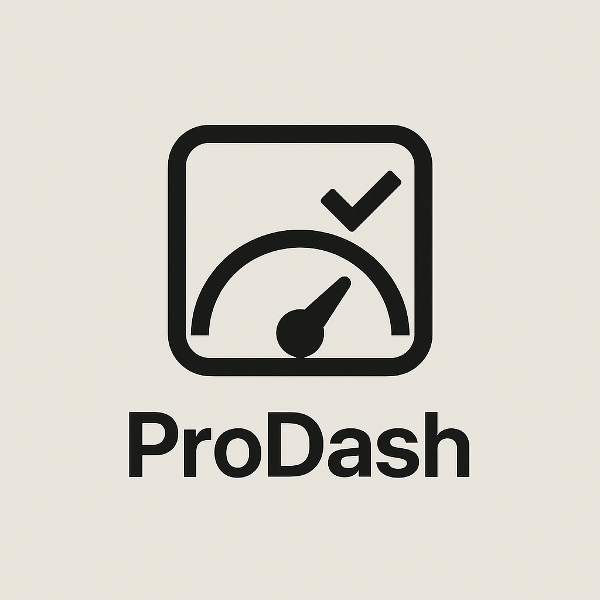
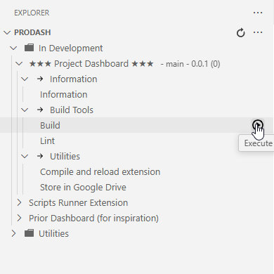
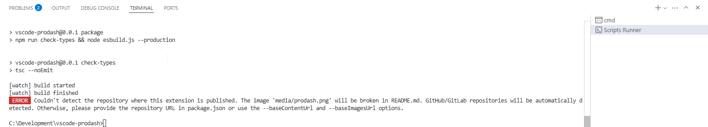

# ProDash

ProDash is a Visual Studio Code extension that provides a project dashboard and script runner, making it easy to organize, manage, and automate tasks across multiple projects.

---

## Features

- **Project Dashboard Tree View**: Visualize and manage your projects and groups in a sidebar tree.
- **Project Groups**: Organize projects into logical groups for easier navigation.
- **Script Groups**: Define and organize scripts for each project.
- **Script Execution**: Run scripts directly from the dashboard or command palette.
- **Command Palette Integration**: Quickly access commands like Edit Groups, Edit Scripts, Refresh, Open Folder, and Execute Script.
- **Automatic Active Project Detection**: The extension highlights the active project based on your current workspace.
- **Configuration Files**: Uses `.prodash/groups.json` and `.prodash/scripts.json` for flexible project and script definitions.
- **Utility Scripts**: Run custom utility scripts and output project information.

---

## Screenshots

---

## Requirements

- Visual Studio Code v1.100.0 or higher
- Node.js (for running scripts, if required by your scripts)

---

## Extension Settings

This extension does not contribute any VS Code settings.  
Project and script configuration is managed via the `.prodash/groups.json` and `.prodash/scripts.json` files in your home or project directory.

---

## Usage

1. **Open the ProDash Sidebar**: Click the ProDash icon in the Activity Bar.
2. **Register Projects**: Edit `.prodash/groups.json` to add your projects and groups.
3. **Define Scripts**: Edit `.prodash/scripts.json` to add script groups and scripts for your projects.
4. **Run Scripts**: Right-click a script in the dashboard or use the command palette to execute it.
5. **Open Project Folders**: Right-click a project and select "Open" to open its folder in VS Code.

---

## Known Issues

- Only the first workspace folder is detected as active.
- Scripts are executed in the default terminal; advanced shell features may require customization.
- No UI for editing groups/scripts yet (edit JSON files manually).

---

## Release Notes

See changelog.md for the full release history.

---

## License

MIT

---

## Author

Thierry Keus
