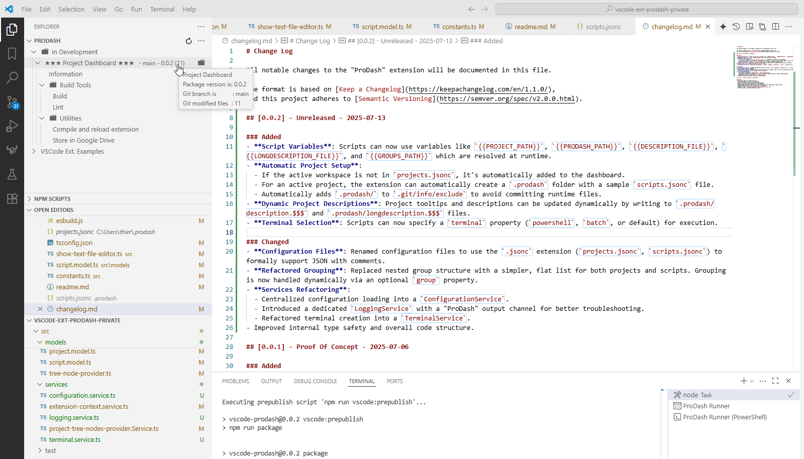

# ProDash

ProDash is a Visual Studio Code extension that provides a powerful project dashboard and script runner, making it easy to organize, manage, and automate tasks across multiple projects.

---

## Features

- **Project Dashboard**: A dedicated tree view in the sidebar to visualize and manage all your projects.
- **Dynamic Grouping**: Organize projects and scripts into collapsible groups using a simple `group` property in your configuration files.
- **Powerful Scripting**:
    - **Script Runner**: Execute scripts directly from the dashboard.
    - **Terminal Selection**: Run scripts in the default terminal, PowerShell, or a Batch shell by setting the `terminal` property.
    - **Script Composition**: Build complex workflows by calling scripts from other scripts using the `{{RUN_SCRIPT:ScriptName}}` syntax.
    - **Script Variables**: Use dynamic variables like `{{PROJECT_PATH}}` and `{{PRODASH_PATH}}` in your scripts for flexible, path-aware commands.
    - **Hidden Scripts**: Create utility scripts that can be called by other scripts but are hidden from the UI.
- **Automatic Configuration**:
    - **Active Project Detection**: Automatically highlights the project that matches your current VS Code workspace.
    - **Zero-Setup for New Projects**: If the active workspace isn't registered, ProDash adds it to the dashboard and can automatically create a `.prodash` folder with a sample `scripts.jsonc` to get you started.
- **Dynamic Project Descriptions**: Update a project's description and tooltip in real-time by modifying `.prodash/description.$$$` and `.prodash/longdescription.$$$` files.
- **File Watching**: Automatically refreshes the dashboard when `projects.jsonc`, `scripts.jsonc`, or description files are modified.
- **Simple JSONC Configuration**: Manage projects and scripts with easy-to-read JSON with Comments files.

---

## Screenshots



---

## Requirements

- Visual Studio Code v1.90.0 or higher

---

## Getting Started

### 1. Global Project Configuration

ProDash uses a central `projects.jsonc` file to define all your projects. This file is located in your user home directory:

- **Windows**: `C:\Users\<YourUser>\.prodash\projects.jsonc`
- **macOS/Linux**: `~/.prodash/projects.jsonc`

You can define projects as a flat list. Use the optional `group` property to organize them in the dashboard.

**Example `projects.jsonc`:**
```jsonc
[
  {
    "name": "My Main Project",
    "path": "/path/to/main/project",
    "description": "The primary project.",
    "group": "Work Projects"
  },
  {
    "name": "Side Project",
    "path": "/path/to/side/project",
    "description": "A personal side project."
  }
]
```

### 2. Project-Specific Scripts

For each project, you can define scripts in a `.prodash/scripts.jsonc` file located within that project's directory.

**Example `scripts.jsonc`:**
```jsonc
[
  {
    "name": "Start Server",
    "description": "Lints the code and then starts the development server.",
    "script": [
      "echo '--- Starting Server ---'",
      "{{RUN_SCRIPT:Lint}}", // Calls another script
      "npm run start"
     ],
    "group": "Development"
  },
  {
    "name": "Build",
    "description": "Creates a production build.",
    "script": ["npm run build"],
    "group": "Build"
  },
  // This is a hidden utility script.
  {
    "name": "Lint",
    "description": "Runs the linter.",
    "script": ["npm run lint"],
    "hidden": true
  }
]
```

---

## Advanced Features

### Script Variables

Your scripts can use variables that ProDash resolves at runtime. This is useful for creating generic, reusable scripts.

| Variable               | Description                                           |
| ---------------------- | ----------------------------------------------------- |
| `{{PROJECT_PATH}}`     | The absolute path to the project's root folder.       |
| `{{PRODASH_PATH}}`     | The path to the project's `.prodash` folder.          |
| `{{DESCRIPTION_FILE}}` | The path to the project's `description.$$$` file.     |
| `{{LONGDESCRIPTION_FILE}}` | The path to the project's `longdescription.$$$` file. |
| `{{GROUPS_PATH}}`      | The path to the global `projects.jsonc` file.         |

**Example:**
```jsonc
{
  "name": "Show Paths",
  "script": [
    "echo Project Path: {{PROJECT_PATH}}",
    "echo ProDash Path: {{PRODASH_PATH}}"
  ]
}
```

### Dynamic Project Descriptions

You can dynamically update a project's description and tooltip from a script. This is useful for displaying runtime information, like the current Git branch or build status.

- **Short Description**: Write to the `.prodash/description.$$$` file. This appears next to the project name.
- **Long Description (Tooltip)**: Write to the `.prodash/longdescription.$$$` file. This appears as a tooltip on hover.

**Example script to update descriptions:**
```jsonc
{
  "name": "Update Git Info",
  "script": [
    "git rev-parse --abbrev-ref HEAD > {{DESCRIPTION_FILE}}",
    "git log -1 --pretty=format:'%h - %s (%cr)' > {{LONGDESCRIPTION_FILE}}"
  ],
  "event": "ON_ACTIVATE" // Run this script automatically when the project is activated
}
```

### Automatic Project Setup

When you open a project folder in VS Code that isn't registered in your global `projects.jsonc`, ProDash provides a seamless setup experience:
1.  The project is automatically added to a temporary "(not registered)" group in the dashboard.
2.  If the project has a `.git` repository, ProDash creates a `.prodash` folder inside it. Otherwise, it's created in the project root.
3.  A sample `scripts.jsonc` file is created inside `.prodash` to help you get started.
4.  The `.prodash` folder is automatically added to `.git/info/exclude` to prevent committing runtime files.

---

## Troubleshooting

ProDash uses a dedicated output channel for logging information and errors. If you encounter any issues, you can check the logs for more details:

1. Open the **Output** view (`Ctrl+Shift+U`).
2. Select **ProDash** from the dropdown menu on the right.

---

## Known Issues

- No UI for editing projects/scripts yet (edit JSON files manually).

---

## Release Notes

See [changelog.md](changelog.md) for the full release history.

---

## License

MIT

---

## Author

Thierry Keus
